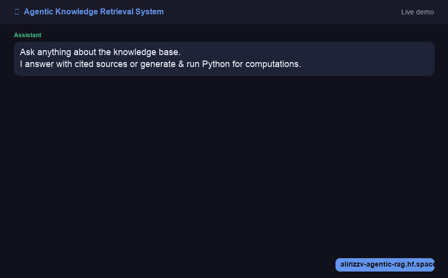
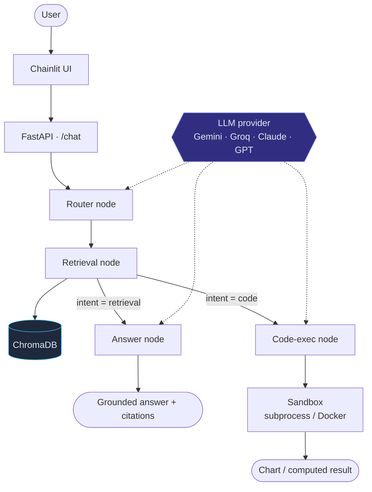
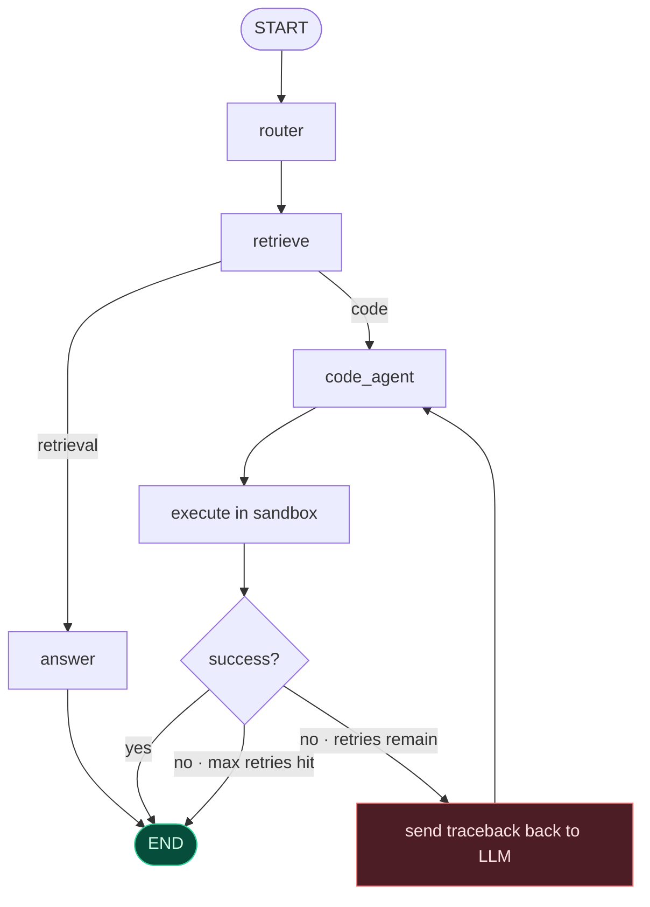
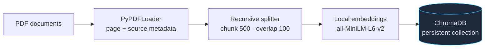
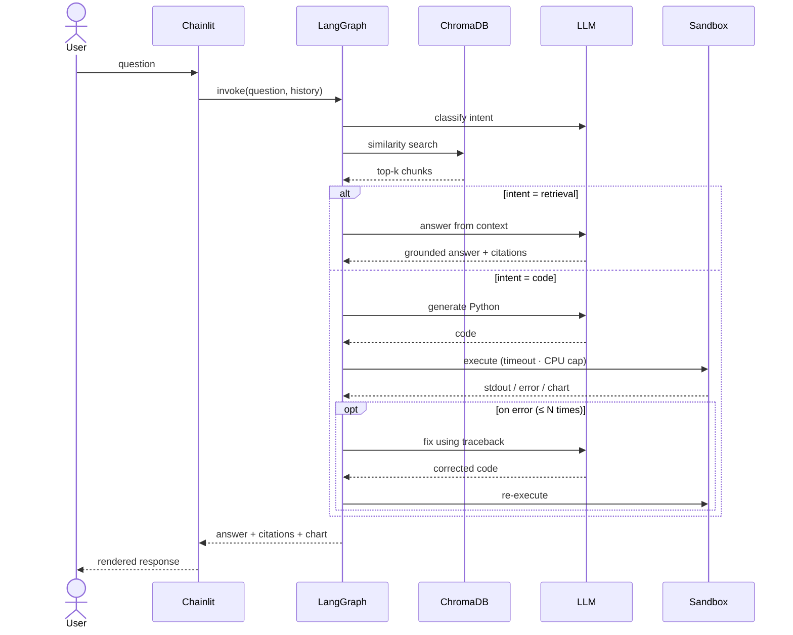

# Agentic Knowledge Retrieval System

<p align="center">
  <a href="https://github.com/alirizzzv/AgenticRetrieval/actions/workflows/ci.yml">
    
  </a>
  
  
  
  
  
  
</p>

<p align="center">
  <a href="https://alirizzv-agentic-rag.hf.space">
    
  </a>
</p>

<p align="center">
  
</p>

A multi-agent Retrieval-Augmented Generation system that answers questions over a
document knowledge base with **citation-grounded** responses, and writes and
executes **sandboxed Python** — with self-correcting retries — to compute or chart
answers directly from retrieved data.

---

## Features

- **Intent-based routing** — a router node classifies each question and dispatches it to the retrieval agent or the code-execution agent.
- **Citation grounding** — every retrieval answer carries its source document and page number; nothing is asserted without a reference.
- **Sandboxed code execution** — generated Python runs in an isolated process with a hard timeout and CPU cap; a Docker backend adds network and memory isolation for production.
- **Self-correcting retries** — when generated code fails, the traceback is fed back to the model and the code is regenerated, up to a configurable retry limit.
- **Provider-agnostic LLM** — switch between Gemini, Groq, Claude, or GPT by changing a single environment variable.
- **Local embeddings** — `sentence-transformers` runs offline with no API cost.
- **History-aware retrieval** — before searching, a follow-up like *"what about the other company?"* is rewritten into a standalone query using the conversation, so retrieval isn't blind to context. Per-session memory backs both the chat UI and the REST API.
- **Guardrails** — per-session and global rate limiting, input-length caps, and graceful failure so the public demo can't be trivially abused, drained, or crashed.

---

## Architecture



**Design principles**

- **Retrieval runs before branching**, so the code agent operates on grounded numbers rather than hallucinated ones.
- **Typed state throughout** — a `TypedDict` graph state flows through every node, so no field is silently dropped.
- **Single source of truth for the vector store** — ingestion (writes) and retrieval (reads) share one accessor and can never disagree on collection, embeddings, or path.
- **Pluggable backends** — both the LLM provider and the sandbox executor are swappable behind a stable interface.

### Execution flow

The LangGraph state machine. The code path loops back on failure until it succeeds
or exhausts its retry budget.



### Ingestion pipeline



### Request lifecycle



---

## Tech Stack

| Layer | Technology |
|---|---|
| Agent orchestration | LangGraph |
| Vector store | ChromaDB |
| Embeddings | sentence-transformers (local) |
| LLM backend | Gemini / Groq / Claude / GPT (swappable) |
| API | FastAPI |
| UI | Chainlit |
| Validation | Pydantic v2 |
| Sandboxing | subprocess + Docker |
| Deployment | Docker · Hugging Face Spaces |

---

## Getting Started

```bash
# 1. Clone
git clone https://github.com/alirizzzv/AgenticRetrieval.git && cd AgenticRetrieval

# 2. Install
python -m venv .venv && source .venv/bin/activate
pip install -r requirements.txt

# 3. Configure the LLM provider
cp .env.example .env          # set LLM_MODEL and the matching API key

# 4. Generate sample documents (or drop your own PDFs into data/)
python scripts/generate_sample_docs.py

# 5. Build the knowledge base
python -m app.ingest.loader   # PDF → chunks → embeddings → ChromaDB

# 6. Run
chainlit run chainlit_app.py  # Chat UI  → http://localhost:8000
uvicorn app.main:app --reload # REST API → http://localhost:8000/docs
```

### Docker

```bash
docker build -t agentic-rag .
docker run -p 7860:7860 -e GROQ_API_KEY=... -e LLM_MODEL=groq:llama-3.3-70b-versatile agentic-rag
```

---

## Configuration

All settings are read from the environment (see `.env.example`). Switch the entire
LLM backend by changing one line:

```bash
LLM_MODEL=google_genai:gemini-2.0-flash      # Google AI Studio (free tier)
LLM_MODEL=groq:llama-3.3-70b-versatile       # Groq (free, fast)
LLM_MODEL=anthropic:claude-3-5-haiku-latest  # Anthropic
LLM_MODEL=openai:gpt-4o-mini                 # OpenAI
```

| Variable | Default | Description |
|---|---|---|
| `LLM_MODEL` | `google_genai:gemini-1.5-flash` | Provider and model, as `provider:model` |
| `EMBEDDING_MODEL` | `sentence-transformers/all-MiniLM-L6-v2` | Local embedding model |
| `SANDBOX_BACKEND` | `subprocess` | `subprocess` or `docker` |
| `SANDBOX_TIMEOUT_SECONDS` | `10` | Hard wall-clock limit per execution |
| `CODE_AGENT_MAX_RETRIES` | `3` | Max self-correction attempts |
| `MAX_QUESTION_CHARS` | `2000` | Reject questions longer than this |
| `RATE_LIMIT_PER_SESSION` | `15` | Requests per window, per session |
| `RATE_LIMIT_GLOBAL` | `60` | Requests per window, all sessions |
| `RATE_LIMIT_WINDOW_SECONDS` | `60` | Rate-limit window length |

---

## Usage

```
User:  What was Northwind Robotics' Q4 revenue?

Agent: Q4 revenue was $138 million [northwind_robotics_2024_annual_report.pdf p.1].
       Full-year revenue was $425 million, up 37% from $310 million in 2023.

       Sources
       • northwind_robotics_2024_annual_report.pdf — p.1


User:  Plot quarterly revenue for all three companies as grouped bars.

Agent: [generates Python → executes in sandbox → returns chart]
       📊 Chart generated  ·  retries: 0
```

---

## Evaluation

Measured on a 10-question set (`eval/qa_set.json`) spanning factual retrieval,
numerical reasoning, and chart generation:

| Metric | Score | Notes |
|---|---|---|
| Citation recall | **7 / 7 (100%)** | Correct source in top-*k* for every retrieval question |
| Router accuracy | **9 / 10 (90%)** | Intent correctly classified |
| Answer accuracy | **9 / 10 (90%)** | Expected facts present in the answer |

```bash
python eval/run_eval.py
```

---

## Testing

A `pytest` suite covers the sandbox executor, the self-correcting retry loop
(fake LLM returns broken code, then correct code — asserting recovery),
citation grounding (only cited sources are surfaced), history-aware retrieval
(follow-ups are rewritten before searching), session memory, schema validation,
and a regression test for the Chainlit context fix. CI runs it on every push
(see the badge above).

```bash
pip install -r requirements-dev.txt
pytest -q
```

---

## Project Structure

```
AgenticRetrieval/
├── chainlit_app.py              # Chat UI entry point
├── app/
│   ├── main.py                  # FastAPI app
│   ├── config.py                # Settings (pydantic-settings)
│   ├── vectorstore.py           # Shared ChromaDB accessor
│   ├── memory.py                # Per-session conversation memory
│   ├── ratelimit.py             # Sliding-window rate limiter
│   ├── chainlit_patch.py        # Portable Chainlit ContextVar fix
│   ├── graph/
│   │   ├── state.py             # Typed graph state
│   │   ├── router.py            # Intent classifier node
│   │   ├── retrieval.py         # Semantic search + citation node
│   │   ├── code_agent.py        # Code-gen + sandbox + retry node
│   │   └── build.py             # LangGraph assembly
│   ├── llm/provider.py          # Swappable LLM + embeddings
│   ├── ingest/loader.py         # PDF → chunks → ChromaDB
│   ├── sandbox/executor.py      # subprocess + Docker backends
│   └── models/schemas.py        # Pydantic schemas
├── tests/                       # pytest suite
├── eval/                        # Evaluation set + harness
├── scripts/                     # Sample-doc + demo-GIF generators
├── data/                        # PDFs + ChromaDB store
├── .github/workflows/ci.yml     # GitHub Actions CI
├── Dockerfile
├── .env.example
├── requirements.txt             # Pinned runtime deps
└── requirements-dev.txt         # + pytest
```

---

## License

Released under the MIT License. See [LICENSE](LICENSE).
